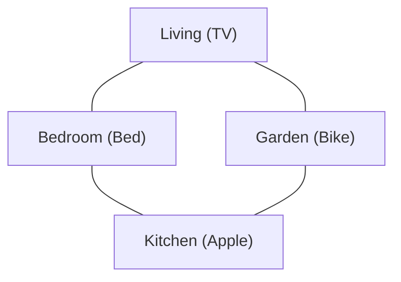

# 1. Introduction

In this project, we address the task of learning control policies for text-based games using reinforcement learning. In these games, all interactions between players and the virtual world are through text. The current world state is described by elaborate text, and the underlying state is not directly observable. Players read descriptions of the state and respond with natural language **commands** to take actions.

For this project you will conduct experiments on a small **Home World**, which mimic the environment of a typical house. The world consists of a few rooms, and each room contains a representative object that the player can interact with. For instance, the kitchen has an **apple** that the player can **eat**. The goal of the player is to finish some quest. An example of a quest given to the player in text is **You are hungry now**. To complete this quest, the player has to navigate through the house to reach the kitchen and eat the apple. In this game, the room is **hidden** from the player, who only receives a description of the underlying room. At each step, the player read the text describing the current room and the quest, and respond with some command (e.g., **eat apple**). The player then receives some reward that depends on the state and his/her command.

In order to design an autonomous game player, we will employ a reinforcement learning framework to learn command policies using game rewards as feedback. Since the state observable to the player is described in text, we have to choose a mechanism that maps text descriptions into vector representations. A naive approach is to create a map that assigns a unique index for each text description. However, such approach becomes difficult to implement when the number of textual state descriptions are huge. An alternative method is to use a bag-of-words representation derived from the text description. This project requires you to complete the following tasks:

1. Implement the tabular Q-learning algorithm for a simple setting where each text description is associated with a unique index.
2. Implement the Q-learning algorithm with linear approximation architecture, using bag-of-words representation for textual state description.
3. Implement a deep Q-network.
4. Use your Q-learning algorithms on the **Home World** game.

## Setup

As with the previous projects, please use Python's NumPy numerical library for handling arrays and array operations; use matplotlib for producing figures and plots.

1. Note on software: For the all the projects, we will use python 3.11 augmented with the NumPy numerical toolbox, the matplotlib plotting toolbox. For THIS project, you will also be using **PyTorch** for implementing Neural Nets.

2. Download `rl.tar.gz` and untar it in to a working directory. The archive contains various data files, along with the following python files:

- [agent_tabular_ql.py](agent_tabular_ql.py) where you will implement an agent using tabular Q-learning
- [agent_linear.py](agent_linear.py) where you will implement an agent using Q-learning with linear approximation
- [agent_dqn.py](agent_dqn.py) where you will implement an agent using a deep Q-network

> **Tip:** Throughout the whole online grading system, you can assume the NumPy python library is already imported as `np`. In some problems you will also have access to python's `random` library, and other functions you've already implemented. Look out for the "Available Functions" Tip before the codebox, as you did in the last project.

This project will unfold both on MITx and on your local machine. However, we encourage you to first implement the functions locally and run the test scripts to validate basic functionality. Think of the online graders as a submission box to submit your code when it is ready. You should not have to use the online graders to debug your code. A good strategy for this project is to first implement all the functions from tab 3 and 4 to check for acceptable performance before submitting your code online.

## 2. Home World Game

In this project, we will consider a text-based game represented by the tuple $\langle H, C, P, R, \gamma, \Psi \rangle$. Here $H$ is the set of all possible game states. The actions taken by the player are multi-word natural language **commands** such as **eat apple** or **go east**. In this project we limit ourselves to consider commands consisting of one action (e.g., **eat**) and one argument object (e.g. **apple**).

$C = \{(a, b)\}$ is the set of all commands (action-object pairs).

$P: H \times C \times H \rightarrow [0, 1]$ is the transition matrix: $P(h' \mid h, a, b)$ is the probability of reaching state $h'$ if command $c = (a, b)$ is taken in state $h$.

$R: H \times C \rightarrow \mathbb{R}$ is the deterministic reward function: $R(h, a, b)$ is the immediate reward the player obtains when taking command $(a, b)$ in state $h$. We consider discounted accumulated rewards where $\gamma$ is the discount factor. In particular, the game state $h$ is **hidden** from the player, who only receives a varying textual description. Let $S$ denote the space of all possible text descriptions. The text descriptions $s$ observed by the player are produced by a stochastic function $\Psi: H \rightarrow S$. Assume that each observable state $s \in S$ is associated with a **unique** hidden state, denoted by $h(s) \in H$.

You will conduct experiments on a small Home World, which mimic the environment of a typical house. The world consists of four rooms - a living room, a bedroom, a kitchen and a garden with connecting pathways (illustrated in figure below). Transitions between the rooms are **deterministic**. Each room contains a representative object that the player can interact with. For instance, the living room has a **TV** that the player can **watch**, and the kitchen has an **apple** that the player can **eat**. Each room has several descriptions, invoked randomly on each visit by the player.

### Rooms and objects in the Home world with connecting pathways

### Table 1: Reward Structure

| Positive | Negative |
| :--- | :--- |
| Quest goal: $+1$ | Negative per step: $-0.01$ |
| | Invalid command: $-0.1$ |

At the beginning of each episode, the player is placed at a random room and provided with a randomly selected quest. An example of a quest given to the player in text is *You are hungry now*. To complete this quest, the player has to navigate through the house to reach the kitchen and eat the apple (i.e., type in command *eat apple*). In this game, the room is *hidden* from the player, who only receives a description of the underlying room. The underlying game state is given by $h = (r, q)$, where $r$ is the index of room and $q$ is the index of quest. At each step, the text description $s$ provided to the player contains two parts $s = (s_r, s_q)$, where $s_r$ is the room description (which are varied and randomly provided) and $s_q$ is the quest description. The player receives a positive reward on completing a quest, and negative rewards for invalid command (e.g., *eat TV*). Each non-terminating step incurs a small deterministic negative rewards, which incentivizes the player to learn policies that solve quests in fewer steps. (see **Table 1**) An episode ends when the player finishes the quest or has taken more steps than a fixed maximum number of steps.

Each episode produces a full record of interaction $(h_0, s_0, a_0, b_0, r_0, \dots, h_t, s_t, a_t, b_t, r_t, h_{t+1} \dots)$ where $h_0 = (h_{r,0}, h_{q,0}) \sim \Gamma_0$ ($\Gamma_0$ denotes an initial state distribution), $h_t \sim P(\cdot \mid h_{t-1}, a_{t-1}, b_{t-1})$, $s_t \sim \Psi(h_t)$, $r_t = R(h_t, a_t, b_t)$ and all commands $(a_t, b_t)$ are chosen by the player. The record of interaction observed by the player is $(s_0, a_0, b_0, r_0, \dots, s_t, a_t, b_t, r_t, \dots)$. Within each episode, the quest remains unchanged, i.e., $h_{q,t} = h_{q,0}$ (so as the quest description $s_{q,t} = s_{q,0}$). When the player finishes the quest at time $K$, all rewards after time $K$ are assumed to be zero, i.e., $r_t = 0$ for $t > K$. Over the course of the episode, the total discounted reward obtained by the player is

$$\sum_{t=0}^{\infty} \gamma^t r_t$$

We emphasize that the hidden state $h_0, \dots, h_T$ are unobservable to the player.

The learning goal of the player is to find a policy $\pi : S \rightarrow C$ that maximizes the expected cumulative discounted reward $\mathbb{E} \left[ \sum_{t=0}^{\infty} \gamma^t R(h_t, a_t, b_t) \mid (a_t, b_t) \sim \pi \right]$, where the expectation accounts for all randomness in the model and the player. Let $\pi^*$ denote the optimal policy. For each observable state $s \in S$, let $h(s)$ be the associated hidden state. The optimal expected reward achievable is defined as

$$V^* = \mathbb{E}_{h_0 \sim \Gamma_0, s \sim \Psi(h)} [V^*(s)]$$

where

$$V^*(s) = \max_{\pi} \mathbb{E} \left[ \sum_{t=0}^{\infty} \gamma^t R(h_t, a_t, b_t) \mid h_0 = h(s), s_0 = s, (a_t, b_t) \sim \pi \right]$$

We can define the optimal Q-function as

$$Q^*(s, a, b) = \max_{\pi} \mathbb{E} \left[ \sum_{t=0}^{\infty} \gamma^t R(h_t, a_t, b_t) \mid h_0 = h(s), s_0 = s, a_0 = a, b_0 = b, (a_t, b_t) \sim \pi \text{ for } t \ge 1 \right]$$

Note that given $Q^*(s, a, b)$, we can obtain an optimal policy:

$$\pi^*(s) = \arg\max_{(a,b) \in C} Q^*(s, a, b)$$

The commands set $C$ contain all $(action, object)$ pairs. Note that some commands are invalid. For instance, **(eat, TV)** is invalid for any state, and **(eat, apple)** is valid only when the player is in the kitchen (i.e., $h_r$ corresponds to the index of kitchen). When an invalid command is taken, the system state remains unchanged and a negative reward is incurred. Recall that there are **four** rooms in this game. Assume that there are **four** quests in this game, each of which would be finished only if the player takes a particular **command** in a particular room. For example, the quest "You are sleepy" requires the player navigates through rooms to bedroom (with commands such as **go east/west/south/north**) and then take a nap on the bed there. For each room, there is a corresponding quest that can be finished there.

Note that in this game, the transition between states is deterministic. Since the player is placed at a random room and provided a randomly selected quest at the beginning of each episode, the distribution $\Gamma_0$ of the initial state $h_0$ is uniform over the hidden state space $H$.

### Questions & Problems

#### Episodic reward

For an episode with $T + 1$ steps (starting from $t = 0$), where the agent obtains a reward $R_t$ at time step $t$. What is the total discounted reward for this episode with a discounted factor $\gamma \in (0, 1)$?

$$\sum_{t=0}^T \gamma^t R_t$$

#### Relation between value function and Q-function

Which of the following equation gives the correct relation between $Q^*$ and $V^*$?

- [ ] $Q^*(s, a, b) = \gamma \mathbb{E} [V^*(s_0) \mid h_0 = h(s), s_0 = s, a_0 = a, b_0 = b]$
- [ ] $Q^*(s, a, b) = \gamma \mathbb{E} [V^*(s_1) \mid h_0 = h(s), s_0 = s, a_0 = a, b_0 = b]$
- [ ] $Q^*(s, a, b) = R(s, a, b) + \mathbb{E} [V^*(s_0) \mid h_0 = h(s), s_0 = s, a_0 = a, b_0 = b]$
- [ ] $Q^*(s, a, b) = R(s, a, b) + \mathbb{E} [V^*(s_1) \mid h_0 = h(s), s_0 = s, a_0 = a, b_0 = b]$
- [ ] $Q^*(s, a, b) = R(s, a, b) + \gamma \mathbb{E} [V^*(s_0) \mid h_0 = h(s), s_0 = s, a_0 = a, b_0 = b]$
- [x] $Q^*(s, a, b) = R(s, a, b) + \gamma \mathbb{E} [V^*(s_1) \mid h_0 = h(s), s_0 = s, a_0 = a, b_0 = b]$

#### Optimal episodic reward

Assume that the reward function $R(s, a, b)$ is given in Table 1. At the beginning of each game episode, the player is placed in a random room and provided with a randomly selected quest. Let $V^*(h_0)$ be the optimal value function for an initial state $h_0$, i.e.,

$$V^*(h_0) = \mathbb{E} \left[ \sum_{t=0}^{\infty} \gamma^t R(h_t, a_t, b_t) \mid h_0, \pi^* \right]$$

Please compute the expected optimal reward for each episode $\mathbb{E} [V^*(h_0)]$. Note that the initial state $h_0$ is uniformly distributed in the state space $H = (r, q) : 0 \le r \le 3, 0 \le q \le 3$. In other words, there are four quests each mapping to a unique room. Assume that the discounted factor is $\gamma = 0.5$.
